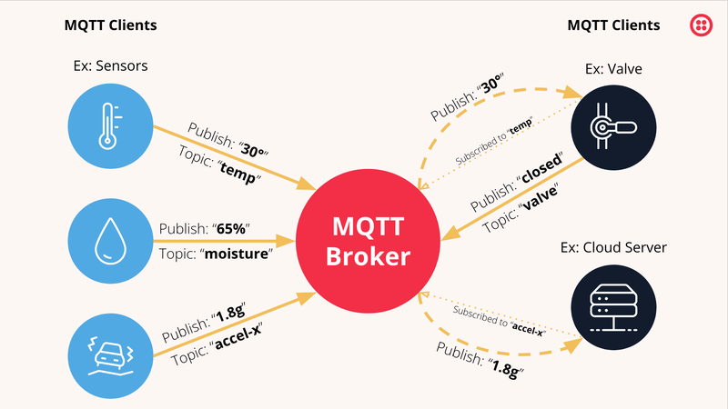
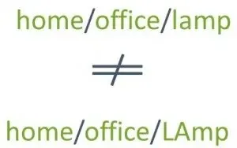

# MQTT — så fungerar det, och så använder du det från Arduino och webbsida

Det här repot är kursmaterialet om **MQTT** på Hitachigymnasiet. Det innehåller:

| Del | Vad |
|---|---|
| [MQTT-introduktion.pptx](MQTT-introduktion.pptx) | Genomgång: hur MQTT fungerar, Arduino, webbsida, felsökning |
| [mqtt_arduino.ino](mqtt_arduino.ino) | ESP8266-sketch: lyssnar på chatten, styr en lampa, svarar |
| [quasar-mqtt/](quasar-mqtt/) | Webbapp (Quasar + MQTT.js): chatt över MQTT |
| [mosquitto-broker/](mosquitto-broker/) | Konfigurationen för skolans broker (Eclipse Mosquitto på CapRover) |

## Snabbstart: skolans broker

| Klient | Adress | Inloggning |
|---|---|---|
| ESP8266 / Arduino | `mqtt-broker.cloud.mustini.com`, port **1883** | ingen |
| Webbsida på http (t.ex. `quasar dev`, Live Server) | `ws://mqtt-broker.cloud.mustini.com:9001` | ingen |
| Webbsida på https (t.ex. GitHub Pages) | `wss://mqtt-broker.cloud.mustini.com` | ingen |
| Terminal | `mosquitto_pub -h mqtt-broker.cloud.mustini.com -t fornamn/test -m hej` | ingen |

Tre regler på en **delad** broker:

1. **Eget prefix** på alla topics: `fornamn/…`. Annars får du andras meddelanden och de får dina.
2. **Unikt clientId** per klient. Två klienter med samma id sparkar ut varandra i en oändlig loop.
3. **Inget känsligt** i meddelandena — alla på brokern kan läsa allt.

---

## 1. Vad är MQTT?

MQTT (*Message Queuing Telemetry Transport*) är ett protokoll för att skicka små meddelanden mellan enheter över nätverk. Det skapades 1999 för att övervaka oljeledningar via satellit — dyr och dålig uppkoppling — och är därför byggt för att vara **litet, snabbt och tåla dåliga nät**. I dag är det standardprotokollet i IoT: robotdammsugare, smarta lampor, elmätare, bilar och industrimaskiner pratar MQTT.

Jämfört med HTTP, som webben bygger på:

| | HTTP | MQTT |
|---|---|---|
| Modell | Fråga–svar: klienten frågar, servern svarar | Publicera–prenumerera: alla pratar via en broker |
| Vem startar? | Alltid klienten | Vem som helst, när som helst |
| Anslutning | Ny för varje fråga | En öppen anslutning hela tiden |
| Overhead per meddelande | Hundratals byte headers | 2 byte + topic + data |
| Många mottagare | Servern måste skicka till var och en | Brokern gör det åt dig |
| Passar | Hämta webbsidor, API:er | Sensorer, styrning, chatt, händelser |

En ESP8266 kan hålla en MQTT-anslutning öppen i veckor och skicka ett mätvärde var tionde sekund utan att märka det. Med HTTP hade den behövt bygga upp en ny anslutning varje gång.

## 2. Tre roller: publisher, broker, subscriber



- **Broker** — servern i mitten. Alla klienter ansluter till den, ingen ansluter till varandra. Brokern tar emot varje meddelande och skickar det vidare till alla som prenumererar på just det ämnet. Skolans broker är en *Eclipse Mosquitto*.
- **Publisher** — en klient som skickar ett meddelande till ett **topic**. T.ex. en ESP8266 som publicerar `23.5` på `fornamn/temp`.
- **Subscriber** — en klient som sagt till brokern "jag vill ha allt som kommer på `fornamn/temp`". Brokern skickar det vidare i samma ögonblick.

Samma klient kan vara både publisher och subscriber — det är precis vad ESP:n i [mqtt_arduino.ino](mqtt_arduino.ino) är: den lyssnar på chatten *och* svarar i den.


Poängen med modellen: **avsändare och mottagare vet inget om varandra**. ESP:n behöver inte veta att det finns en webbsida, och webbsidan behöver inte ESP:ns IP-adress. Båda känner bara till brokern och topic-namnet. Vill du lägga till en tredje klient (en Python-logger, en ROS2-nod, en telefon) ansluter den bara och prenumererar — ingenting annat behöver ändras.

## 3. Topics

Ett topic är en textsträng som fungerar som "kanal". Nivåer separeras med `/`:

```
fornamn/bil/hastighet
fornamn/bil/avstand
fornamn/hem/kok/temp
```

- Skiftlägeskänsligt: `fornamn/Lampa` och `fornamn/lampa` är två olika topics.
- Inga mellanslag, inga `+`/`#` i namnet, börja inte med `/`.
- Topics behöver inte skapas i förväg. Första publiceringen "skapar" det.
- Brokern bryr sig inte om innehållet — den matchar bara topic-strängar.



### Wildcards — prenumerera på flera topics

| Prenumeration | Matchar | Matchar inte |
|---|---|---|
| `fornamn/bil/hastighet` | exakt det | allt annat |
| `fornamn/bil/+` | `fornamn/bil/hastighet`, `fornamn/bil/avstand` | `fornamn/bil/motor/varv` (två nivåer) |
| `fornamn/#` | allt som börjar med `fornamn/`, hur många nivåer som helst | `annan/…` |
| `#` | **allt på brokern** | — |

`+` ersätter *en* nivå, `#` ersätter *alla återstående* och får bara stå sist. Wildcards fungerar bara när man prenumererar — man kan inte publicera till `fornamn/+`.

Tips vid felsökning: `mosquitto_sub -h mqtt-broker.cloud.mustini.com -t "fornamn/#" -v` visar allt du själv skickar.

## 4. Meddelanden (payload)

Innehållet är bara bytes. Brokern tolkar dem inte. I praktiken skickar man:

**Ren text** — enklast, bra för ett värde:

```
topic: fornamn/temp      payload: 23.5
topic: fornamn/lampa     payload: on
```

**JSON** — när du behöver flera fält. Det är vad chatten i det här repot använder:

```json
{"user": "salle", "message": "Hej!"}
```

På ESP8266 kan du bygga JSON med strängar (se sketchen) eller biblioteket *ArduinoJson*. I webbläsaren: `JSON.stringify()` och `JSON.parse()`.

Håll meddelandena små. Max på Mosquitto är flera MB, men en ESP8266 har ~40 kB RAM. Skicka `23.5`, inte `Temperaturen är just nu 23.5 grader`.

### Retained messages

Publicerar du med flaggan **retain** sparar brokern det senaste meddelandet på det topicet. En klient som prenumererar *senare* får det direkt. Perfekt för "läget just nu" (lampan är på, senaste temperaturen) — då behöver en nystartad webbsida inte vänta på nästa mätning.

```cpp
client.publish("fornamn/lampa", "on", true);   // true = retain
```

## 5. Anslutningen

När en klient ansluter skickar den ett `CONNECT`-paket med några viktiga inställningar:

| Inställning | Vad det är | Vad du ska välja |
|---|---|---|
| **clientId** | Klientens namn på brokern. Måste vara unikt. | `fornamn-esp`, `fornamn-webb-` + slumptal |
| **keep-alive** | Hur ofta klienten "pingar" så brokern vet att den lever (sekunder) | Standard 15–60 s räcker |
| **clean session** | `true` = börja om vid varje anslutning. `false` = brokern minns prenumerationer och köar meddelanden medan du är borta | `true` om du inte vet varför du vill ha annat |
| **last will** | Ett meddelande brokern skickar *åt dig* om du försvinner utan att koppla ner snyggt | `fornamn/status` = `offline` — då ser webbsidan att ESP:n tappade WiFi |
| användarnamn/lösenord | Inloggning | Skolans broker kräver inget |

Klienten och brokern håller sedan anslutningen öppen. Tappas WiFi återansluter biblioteken automatiskt (EspMQTTClient och MQTT.js gör det åt dig), men prenumerationerna måste göras om — därför ligger `subscribe()` i `onConnectionEstablished()` i Arduino-koden, inte i `setup()`.

## 6. QoS — hur säkert ska det fram?

| QoS | Betyder | Används till |
|---|---|---|
| **0** | "Skicka och glöm". Snabbast. Kan tappas om nätet hackar. | Sensorvärden som kommer igen om 10 s |
| **1** | Kommer fram minst en gång (kan dubbleras) | Kommandon: `lampa on` |
| **2** | Kommer fram exakt en gång. Långsammast. | Betalningar, räknare — sällan i skolan |

Standard i alla bibliotek är QoS 0, och det räcker nästan alltid. Byt till 1 för kommandon om du märker att de ibland försvinner.

## 7. Portar och transport

MQTT kan gå över flera "bärare". Adressen avgör vilken:

| Adress | Port | Transport | Vem |
|---|---|---|---|
| `mqtt://host` eller bara `host` | 1883 | TCP | ESP8266, Python, mosquitto_pub |
| `mqtts://host` | 8883 | TCP + TLS | Samma, krypterat |
| `ws://host:9001` | 9001 | WebSockets | Webbläsare på http |
| `wss://host` | 443 | WebSockets + TLS | Webbläsare på https |

**Webbläsare kan inte öppna vanliga TCP-anslutningar** — därför måste webbsidor använda WebSockets. Och en sida som laddats över **https får inte öppna `ws://`** ("mixed content") — då måste det vara `wss://`. Det är den vanligaste orsaken till att "det fungerar lokalt men inte på GitHub Pages". Webbappen i det här repot väljer rätt adress automatiskt utifrån `window.location.protocol`.

---

## 8. Från Arduino / ESP8266

Bibliotek: **EspMQTTClient** (Arduino IDE → *Library Manager* → sök "EspMQTTClient"; det installerar även *PubSubClient*). Det sköter WiFi, anslutning och återanslutning.

```cpp
#include "EspMQTTClient.h"

EspMQTTClient client(
  "Hitachigymnasiet_2.4", "wifi-lösenord",   // WiFi
  "mqtt-broker.cloud.mustini.com",            // broker
  "", "",                                     // användarnamn, lösenord (inget)
  "fornamn-esp",                              // clientId – unikt!
  1883                                        // port
);

void onConnectionEstablished() {              // körs varje gång vi (åter)ansluter
  client.subscribe("fornamn/lampa", [](const String& payload) {
    digitalWrite(LED_BUILTIN, payload == "on" ? LOW : HIGH);   // inbyggd LED lyser vid LOW
  });
  client.publish("fornamn/status", "online");
}

void setup() {
  Serial.begin(115200);
  pinMode(LED_BUILTIN, OUTPUT);
  client.enableDebuggingMessages();           // visar WiFi/MQTT-status i Serial Monitor
}

void loop() {
  client.loop();                              // måste anropas hela tiden – inga delay()!
}
```

Tre saker som brukar gå fel:

- **`delay()` i `loop()`** — blockerar `client.loop()`, anslutningen tappas. Använd `millis()` eller `client.executeDelayed()`.
- **Prenumerera i `setup()`** — anslutningen finns inte ännu. Gör det i `onConnectionEstablished()`.
- **Skicka för ofta** — en publicering var 100 ms är okej, tusen per sekund är det inte.

Den fullständiga sketchen med chatt-svar finns i [mqtt_arduino.ino](mqtt_arduino.ino). Vill du använda *PubSubClient* direkt (utan EspMQTTClient) är principen densamma: `setServer`, `setCallback`, `connect`, `subscribe`, `loop`.

## 9. Från en webbsida

Bibliotek: **MQTT.js**. Enklast i en vanlig HTML-sida via CDN:

```html
<script src="https://unpkg.com/mqtt/dist/mqtt.min.js"></script>
<script>
  // ws:// på http-sidor, wss:// på https-sidor
  const url = location.protocol === 'https:'
    ? 'wss://mqtt-broker.cloud.mustini.com'
    : 'ws://mqtt-broker.cloud.mustini.com:9001'

  const client = mqtt.connect(url, { clientId: 'fornamn-webb-' + Math.random().toString(16).slice(2, 8) })

  client.on('connect', () => {
    console.log('ansluten')
    client.subscribe('fornamn/#')
  })

  client.on('message', (topic, payload) => {
    console.log(topic, payload.toString())      // payload är bytes -> toString()
  })

  document.querySelector('#on').onclick  = () => client.publish('fornamn/lampa', 'on')
  document.querySelector('#off').onclick = () => client.publish('fornamn/lampa', 'off')
</script>
```

I ett byggt projekt (Vite, Quasar, Vue, React) installerar du i stället `npm install mqtt` och skriver `import mqtt from 'mqtt'`. Se [quasar-mqtt/src/boot/mqtt-boot.js](quasar-mqtt/src/boot/mqtt-boot.js) för en komplett variant med återanslutning och status.

Två fallgropar:

- **Content-Security-Policy.** Har sidan en CSP (Quasar-mallen har det) måste brokerns adress stå under `connect-src`, annars blockeras WebSocket-anslutningen tyst.
- **`payload` är inte en sträng** — det är en `Uint8Array`/`Buffer`. Kör `payload.toString()` innan du jämför eller `JSON.parse`:ar.

## 10. Testa och felsök

**Från terminalen** (macOS: `brew install mosquitto`, Ubuntu/WSL: `sudo apt install mosquitto-clients`):

```bash
# Terminal 1: lyssna på allt under ditt prefix, -v visar topic-namnet
mosquitto_sub -h mqtt-broker.cloud.mustini.com -t "fornamn/#" -v

# Terminal 2: skicka
mosquitto_pub -h mqtt-broker.cloud.mustini.com -t fornamn/lampa -m on
```

**Grafiskt:** [MQTTX](https://mqttx.app/) eller [MQTT Explorer](https://mqtt-explorer.com/) — anslut till `mqtt-broker.cloud.mustini.com:1883`, prenumerera på `fornamn/#` och se allt som händer i realtid. Bra för att se om det är ESP:n eller webbsidan som inte gör sitt.

**Felsök i rätt ordning:** terminal → ESP → webbsida. Fungerar `mosquitto_sub`/`mosquitto_pub` så är brokern okej, och felet sitter i din kod.

| Symptom | Trolig orsak |
|---|---|
| ESP:n loggar `Connecting to MQTT…` i all oändlighet | Fel broker-adress/port, eller WiFi utan internet |
| ESP:n ansluter men reagerar inte | Fel topic (stavning, skiftläge, prefix), eller `subscribe` ligger i `setup()` |
| ESP:n kopplar upp och ner hela tiden | Någon annan använder samma clientId — eller `delay()` i `loop()` |
| Webbsidan: inget händer, inget fel | CSP blockerar, eller `ws://` på en https-sida — öppna webbläsarens konsol (F12) |
| Webbsidan tar emot `[object Uint8Array]` | Glömt `payload.toString()` |
| Jag får andras meddelanden | Du prenumererar på `#` eller saknar eget prefix |
| Meddelanden kommer dubbelt | Två flikar/klienter öppna, eller noden startad två gånger |

## 11. Säkerhet

Skolans broker är öppen: ingen inloggning, ingen kryptering på 1883/9001. Det är medvetet för att det ska vara enkelt i undervisningen — men det betyder att **vem som helst på internet kan läsa och skriva alla topics**. Så:

- Skicka aldrig lösenord, personuppgifter eller något du inte vill att andra ser.
- Styr inget som kan göra skada om någon annan skickar `on`.
- I ett riktigt system: användarnamn/lösenord per enhet, TLS (`mqtts://`/`wss://`) och *ACL:er* som begränsar vilka topics varje klient får använda. Mosquitto stödjer allt det — se [mosquitto-broker/](mosquitto-broker/).

## 12. Kör en egen broker

Ibland vill man testa utan internet, eller ha en broker bara för klassrummet. Konfigurationen i [mosquitto-broker/](mosquitto-broker/) startar en Mosquitto lokalt med Docker på två rader. Samma filer är det som kör skolans broker i CapRover.

## Resurser

- [MQTT Essentials (HiveMQ)](https://www.hivemq.com/mqtt-essentials/) — den bästa genomgången av protokollet, på engelska
- [mqtt.org](https://mqtt.org/) — specifikationen och lista över bibliotek
- [MQTT.js](https://github.com/mqttjs/MQTT.js) — webbläsare och Node
- [EspMQTTClient](https://github.com/plapointe6/EspMQTTClient) — ESP8266/ESP32
- [MQTTX](https://mqttx.app/) — grafisk testklient
- [Video: MQTT förklarat på 10 minuter](https://www.youtube.com/watch?v=f4JmhGBsRkQ)
- [vue-joystick-component](https://superhussain.github.io/vue-joystick-component/#/story/stories-joystick-story-vue?variantId=_default) — joystick till bilstyrning i Vue
